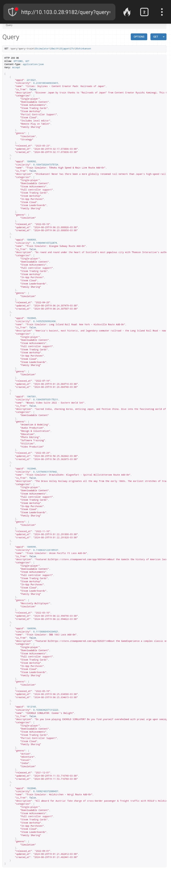
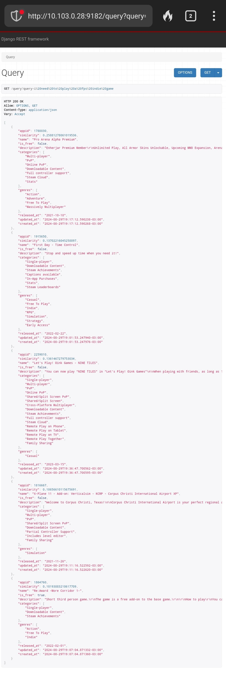
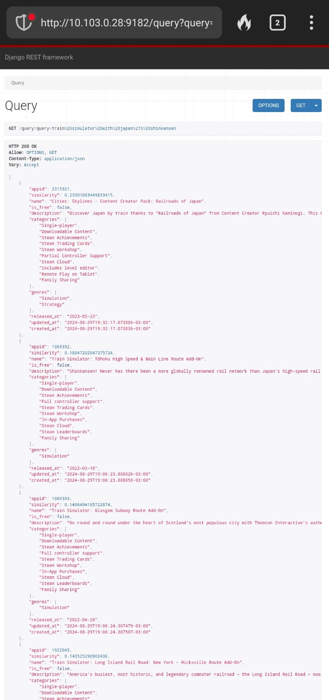

# APS1-NLP

This project is a Django-based API designed for managing and querying game data using natural language processing (NLP) techniques. The API integrates with external services like Steam to fetch game details and utilizes TF-IDF to allow for content-based queries.

## Table of Contents

- [APS1-NLP](#aps1-nlp)
  - [Table of Contents](#table-of-contents)
  - [Project Overview](#project-overview)
  - [Features](#features)
  - [Project Structure](#project-structure)
    - [Key Django Apps](#key-django-apps)
  - [Installation](#installation)
  - [Configuration](#configuration)
  - [Usage](#usage)
    - [Running the Project](#running-the-project)
  - [API Endpoints](#api-endpoints)
  - [Database Content Creation](#database-content-creation)
    - [How it Works](#how-it-works)
    - [Content used for TF-IDF](#content-used-for-tf-idf)
  - [Tests](#tests)
    - [Test that yields 10 results](#test-that-yields-10-results)
    - [Test that yields less than 10 results](#test-that-yields-less-than-10-results)
    - [Test that yields something non-obvious](#test-that-yields-something-non-obvious)

## Project Overview

The APS1-NLP project provides an API for managing a database of games, fetching data from Steam, and performing content-based searches using TF-IDF. The primary focus is on processing game data and enabling users to query this data using natural language.

## Features

- **Game Data Management**: Fetch and store game data from the Steam API.
- **NLP Integration**: Query games using TF-IDF to find similar content.
- **RESTful API**: Expose game data and NLP features through well-defined endpoints.
- **Docker Support**: Containerized setup for easy deployment and scaling.
- **Proxy Support**: Configuration for proxy setups to manage traffic and security.

## Project Structure

The project is organized as follows:

```
.
├── api
│   ├── __init__.py
│   ├── asgi.py
│   ├── settings.py
│   ├── urls.py
│   ├── views.py
│   └── wsgi.py
├── games
│   ├── __init__.py
│   ├── admin.py
│   ├── apps.py
│   ├── migrations
│   │   ├── 0001_initial.py
│   │   ├── 0002_game_released_at.py
│   │   └── __init__.py
│   ├── models.py
│   ├── serializers.py
│   ├── urls.py
│   └── views.py
├── manage.py
├── nlp
│   ├── __init__.py
│   ├── apps.py
│   ├── migrations
│   │   └── __init__.py
│   ├── nlp
│   │   ├── __init__.py
│   │   └── tf_idf.py
│   ├── urls.py
│   └── views.py
└── utils
    ├── __init__.py
    ├── apps.py
    ├── management
    │   ├── __init__.py
    │   └── commands
    │       ├── __init__.py
    │       ├── check_and_create_superuser.py
    │       └── wait_for_db.py
    └── migrations
        └── __init__.py
```

### Key Django Apps

- **api**: Core configuration for the Django project, including settings, URLs, and WSGI/ASGI setups.
- **games**: Manages the game-related data, including models, serializers, views, and migrations.
- **nlp**: Handles NLP functionalities, particularly the TF-IDF model implementation for querying game data.
- **utils**: Contains utility scripts and management commands, including database checks and superuser creation.

## Installation

1. **Clone the repository**:

   ```bash
   git clone https://github.com/NicolasQueiroga/aps1-nlp.git
   cd aps1-nlp
   ```

## Configuration

The project uses environment variables defined in the `.env` file. Copy the sample `.env.sample` to `.env` and adjust as necessary.

```bash
cp .env.sample .env
```

## Usage

### Running the Project

To start the project with Docker, simply run:

```bash
docker compose up
```

## API Endpoints

- **Game Management**:
  - `GET /games/`: List all games.
  - `GET /games/<id>/`: Get details of a specific game.
  - `POST /games/`: Add a new game. **(Requires authentication)**
  - `PUT /games/<id>/`: Update an existing game. **(Requires authentication)**
  - `DELETE /games/<id>/`: Delete a game. **(Requires authentication)**
  - `GET /games/fetch-games/`: Fetch and store games from the Steam API. **(Requires authentication)**

- **NLP Query**:
  - `GET /nlp/query?query=<text>`: Search for games similar to the given text using TF-IDF.

## Database Content Creation

The content of the database is populated by fetching data from the Steam API through the `fetch_games_from_steam` action in the `GameViewSet`.

### How it Works

1. **Fetch Steam Game IDs**: The method first retrieves a list of game IDs from the Steam API.
2. **Fetch Game Details**: For each game ID, it makes a request to the Steam Store API to retrieve detailed information about the game.
3. **Data Processing**: The API extracts relevant fields, such as the game name, description, categories, genres, and release date. The game description is cleaned to remove HTML tags, and the content field is generated to store a combined string of all relevant data.
4. **Database Insertion**: If the game does not already exist in the database, a new `Game` object is created and saved. If it already exists, the record is updated with the latest information.

This method is invoked via a custom endpoint, allowing you to trigger the data population manually:

```bash
GET /games/fetch-games/
```

### Content used for TF-IDF

```python
content = f"{name} {'free' if is_free else 'paid'} {game_age_category} {' '.join(categories)} {' '.join(genres)} {detailed_description}"
```

## Tests

### Test that yields 10 results

- http://10.103.0.28:9182/query?query=train%20simulator%20with%20japan%27s%20shinkansen




### Test that yields less than 10 results

- http://10.103.0.28:9182/query?query=i%20need%20to%20play%20a%20fps%20indie%20game



### Test that yields something non-obvious

- http://10.103.0.28:9182/query?query=train%20simulator%20with%20japan%27s%20shinkansen

The results you provided are good examples of non-obvious matches for the query "train simulator with Japan's Shinkansen" because they both relate to trains and Japan, but they approach the topic from different, less direct angles than a straightforward Shinkansen simulation game might. Here's why they are non-obvious but relevant:

1. **Cities: Skylines - Content Creator Pack: Railroads of Japan**:
   - **Relevance**: This is not a train simulator per se but a content pack for a city-building game that includes Japanese railroads, stations, and trains. It allows players to add authentic Japanese railroad scenery, including Shinkansen stations and other elements, to their cities.
   - **Non-Obvious Connection**: The primary game focus is city-building, not train simulation. However, the content pack offers a way to experience Japanese railroads, indirectly touching on the Shinkansen theme by letting players design and interact with elements of Japanese rail systems within the broader scope of city management.

2. **Train Simulator: Tōhoku High Speed & Main Line Route Add-On**:
   - **Relevance**: This is a direct extension for a train simulation game that includes Japan's Shinkansen, specifically the Tōhoku High Speed Line. It offers a detailed and authentic experience of driving both high-speed Shinkansen and local commuter trains.
   - **Non-Obvious Connection**: While this add-on is a clear match, it's non-obvious in the sense that it's not a standalone game but an expansion that requires the base Train Simulator game. Users looking for "train simulator with Japan's Shinkansen" might not immediately consider DLCs or expansions, focusing instead on full games.

In both cases, these results show that the search algorithm recognized thematic relevance to Japanese trains and Shinkansen, even though one is a content pack for a city-building game and the other is a route add-on for an existing train simulator. This makes them non-obvious but creatively relevant matches to the query.




The content used for the TF-IDF model is the combined string of the game name, price category, age category (new or old, depending on the release date), categories, genres, and detailed description. This content is used to generate the TF-IDF matrix and compute similarity scores for content-based queries.
